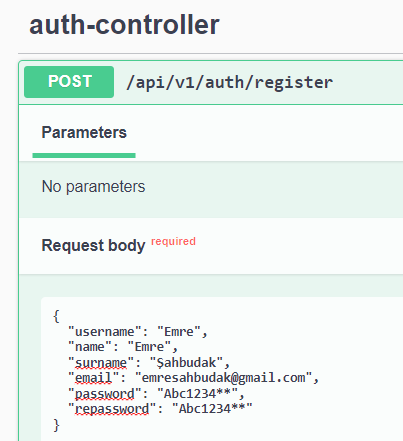
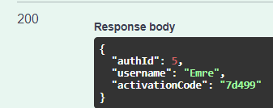
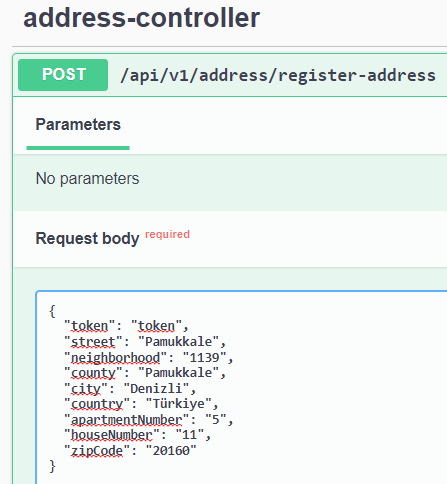
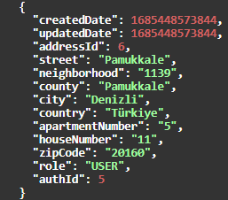
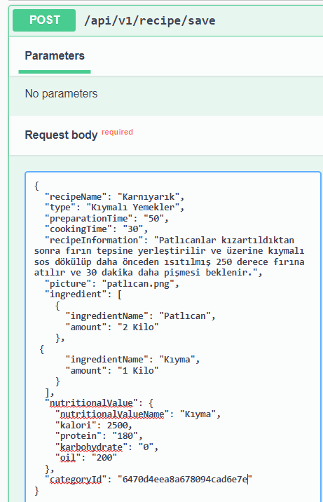
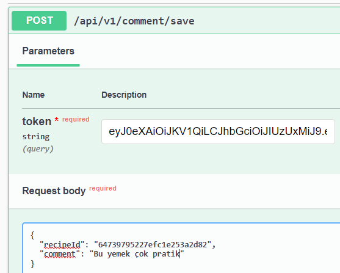

### Spring MikroServis Proje --> YemekTarifi
#### Kurulum
1.0. Dependencies.gradle dosyası oluşturarak bağımlılıklarımızı içeren library ve versiyonları burada topladık. \
1.1. Kullanıcağımız teknolojileri tüm yapıda kullanıcaksak kök dizinin build.gradle dosyasına yada kullanılacak mikroservisin build.gradle dosyasına ekledik \
1.2. Bağımlılıkları ekledikten sonra mikroservisleri modül olarak projemize dahil ettik. \
1.3. Projelerin yapılandırma dosyalarını kontrol etmek için config-server mikroservisinide modül olarak kurduk. \
1.4. Configserver içinde ki config-repo dosyasında tüm mikroservsilerin yapılandırma dosyalarını oluşturduk. \
1.5. ConfigServer yayın yapabilsin diye ***springCloudConfigServer*** ve ***springCloudConfigStarter*** build.gradle dosyasına bunu ekledik. \
1.6. Diğer mikroservislerde buradan yapılandırma dosyalarını çekebilsinler diye ***springCloudConfigClient*** build.gradle ekledik.\
1.7. Authservisinde PostgreSQL diğer servislerde de MongoDB kullanacağımız için veritabanlarını kurduk.

#### Katmanlı Mimari ve Proje Akışı
1.0. Katmanlı mimariye uygun olarak tüm mikroservislerde entity,repository, service,controller katmanları ve diğer yardımcı katmanlar oluşturuldu. \
1.1. Authmikroservisinde kullanıcının sisteme kayıt olma,kayıtlıysa oturum açma işlemleri yönetilmiştir. Oturum açtıktan sonra kullanıcıya bir Token dönülmüş ve tüm işlemleri token ile yapmasına izin verilmiştir. \
1.2. Register metodu için örnek resim; \

 \
1.3. Kullanıcı kayıt olduktan sonra sisteme Adres bilgilerini girmesi istenmiştir. \
1.4. Adres kayıt metodu için örnek resim; \
 \
 \
1.5. User mikroservisinde kullanıcı işlemlerini yönetilmesi sağlanmıştır.(Update vb.) Bu mikroserviste veritabanından kullanıcı verilerin çekilip diğer servislere aktarılma işlemleri yapılmıştır. \
1.6. Mail mikroservisinde kullanıcının aktivasyon kodunun, şifreyi unuttuysa eğer yeni şifrenni maile gitmesi vb. mail ile yönetilebilecek işlemlerin yapılması sağlanmıştır.
1.7. Maile gelen Yeni Şifre örnek resmi; \
 \
1.8. Recipe mikroservisinde ise sisteme tarif ekleme, listeleme,güncellemei,silme işlemleri yapılmıştır. \
1.9. Tarif ekleme metodu örnek resmi; \
 \
2.0. Aynı zamanda kullanıcılar için;
- Kategorilerine göre
- Tarif ismine göre
- Malzeme isimlerine göre
- Kalorisine göre sıralama \
işlemlerine olanak sağlanmıştır.

2.1. Comment mikroservisinde ise kullanıcılar istediği tariflere yorum ekleme, beğenme ve favoriye alma işlemleri yapılmıştır.\
2.2. Yorum yapma metodu için örnek resim; \

#### Temel olarak proje gelişmeye hala açıktır ve üzerinde kodlamaları devam etmektedir.